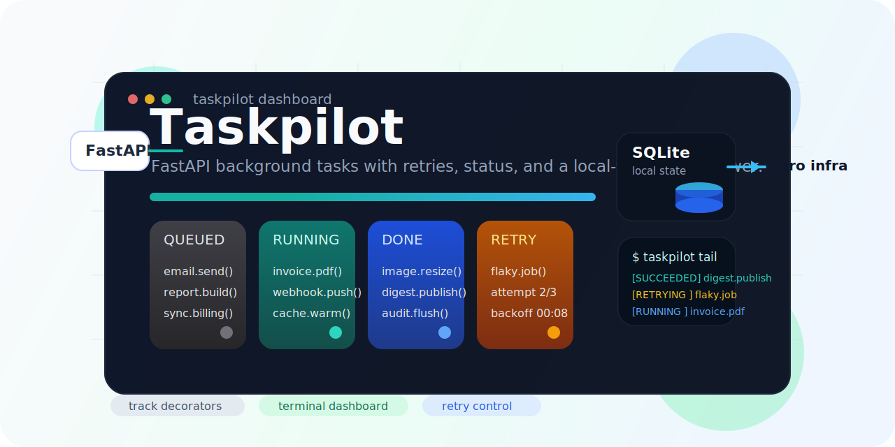

  

# taskpilot

Drop-in FastAPI background task tracking with SQLite. Status, retries, terminal dashboard. Zero infrastructure.

Taskpilot wraps FastAPI background work with durable task state, retry visibility, and direct CLI inspection. It is built for teams that want observability and control without adding Redis, RabbitMQ, or another service to operate.

Track work as it moves from queued to running to done, inspect failures, and retry dead jobs from a local SQLite-backed control plane.
